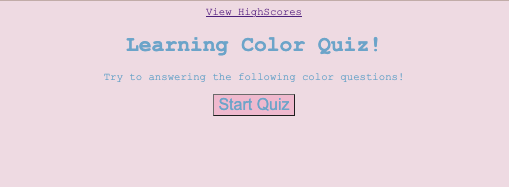
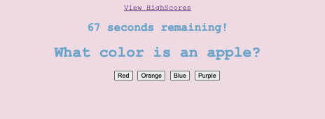
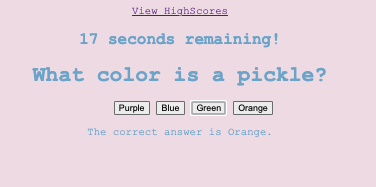
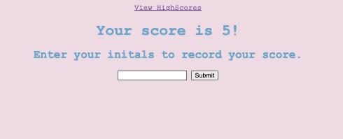
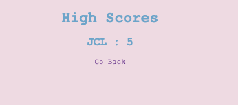

# LC-quiz
This quiz is going to ask a series of question regarding What Color is an object. You you have 4 options to choose from, if you get the wrong answer you will be deducted 10 seconds from the timer. At the end of the game you will be able to input your initials to record your highscore. 

# Framework 
For this quiz game I used a series of functions, arrays within a variable, if, else statments and querySelectors. For the highscore, I used localStorage, to be able to store the users initials and score in one file, and get in another file.  

# Screenshots 

# Links
Here is a link to the live page: https://lundeej.github.io/LC-quiz/
